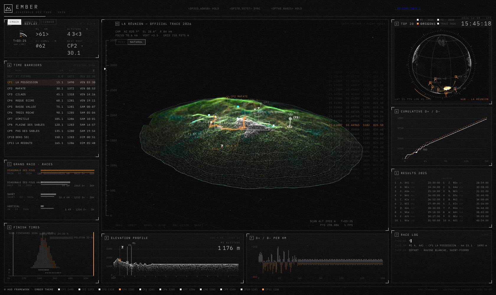
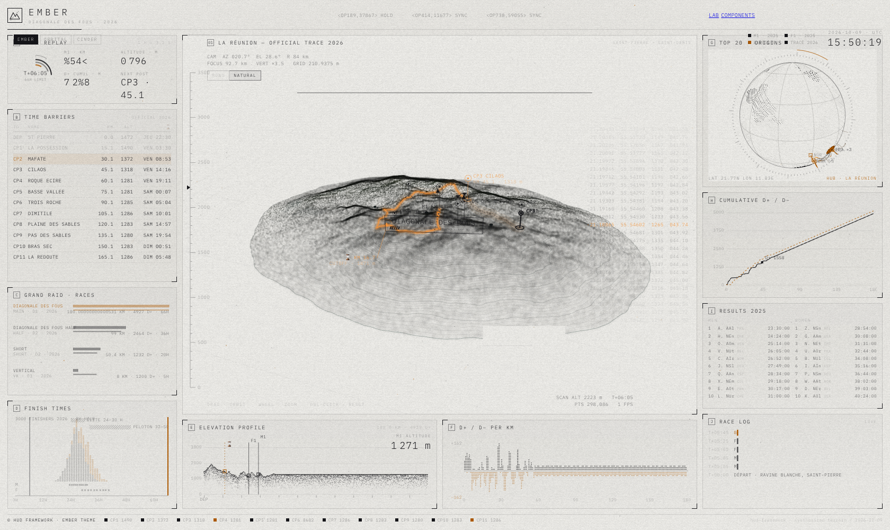
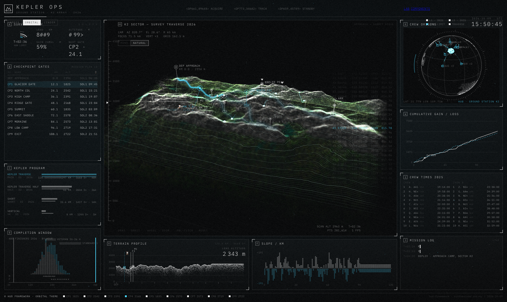
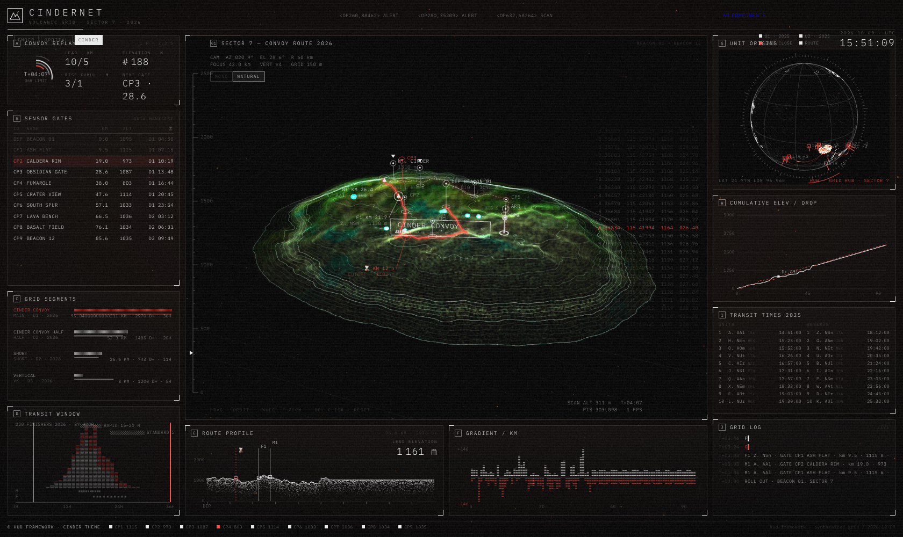
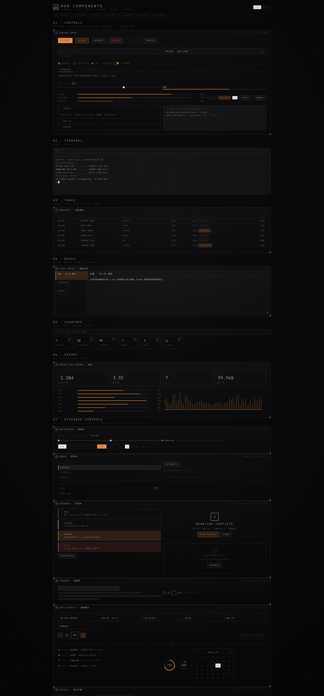

# HUD Console Framework · 中文说明

从 [beastydesign/scifi](https://beastydesign.github.io/scifi/) 提炼的科幻 HUD 控制台框架:设计令牌驱动、深浅双场景、零依赖、无构建。

[English](../README.md) · 在线 demo:<https://losecher.github.io/hud-console-framework/>

## 截图

| 深色主控台 | 浅色纸墨场景 |
|---|---|
|  |  |

| ORBITAL 主题 | CINDER 主题 |
|---|---|
|  |  |

控件库全览(terminal / table / notes / launcher / report + 对照 shadcn·AntD 补齐的 24 项扩展控件):



## 快速开始

```bash
npm run dev        # -> http://localhost:7100 (或 PORT 环境变量)
```

任何静态文件服务器都可以,没有构建步骤。

## 页面

| 入口 | 用途 |
|---|---|
| `index.html` | 主控台演示(3D 地形 + 2D 仪表,三主题可切) |
| `components.html` | 控件库(01 基础 · 02 终端 · 03 表格 · 04 笔记 · 05 启动器 · 06 报表 · 07 扩展 24 项) |
| `lab.html` | 令牌实验室(点缀色参数 / 线宽 / 场景切换,全部可 URL 复现) |

URL 参数:`?theme=ember|orbital|cinder` `?scheme=dark|light` `?linew=0.5..3`
lab 额外支持 `?density=&ratio=&opacity=&comet=&accent=rrggbb`。

## 目录结构

```
hud-framework/
├── index.html / lab.html / components.html   三个入口页
├── server.mjs / package.json                 零依赖静态开发服务器
├── assets/fonts/                             IBM Plex Mono(唯一字体,OFL 许可)
├── css/
│   ├── hud.css                               设计令牌(:root 变量)+ 页面 chrome
│   └── hud-components.css                    全部 hud-* 控件(仅消费令牌)
├── js/
│   ├── core/                                 与业务无关的可复用层
│   │   ├── palette.js                        运行时取色:ink()/fgStr()/bgStr(),深浅双场景之本
│   │   ├── sparks.js                         点缀色火星系统(流场微粒/彗星)
│   │   ├── chrome.js                         顶栏/页脚/时钟/噪点等装饰层
│   │   ├── synth.js                          演示数据合成器(外部项目不需要)
│   │   ├── glkit.js                          WebGL2 小工具库
│   │   └── util.js                           随机数/噪声/哈希
│   └── views/                                演示专属视图(外部项目不需要)
│       ├── main.js                           主控台编排器
│       ├── terrain3d.js / globe.js / panels2d.js
├── themes/                                   主题配置(纯数据对象,可无限扩展)
├── tokens/
│   ├── base.json                             设计令牌唯一事实来源
│   ├── component-checklist.md                对照 shadcn/ui / Ant Design 的覆盖矩阵
│   └── scheme-analysis.md                    深浅双场景可行性分析
└── docs/
    ├── adoption.md                           ★ 外部项目适配指引
    └── optimization-review.md                重叠遮罩/着色器/性能审查(对照 pretext 与 paper-design/shaders)
```

## 核心约束(详见 docs/adoption.md)

- 一切颜色走 `tokens/base.json` → CSS 变量 → `palette.js`,**禁止硬编码白/黑**;
- 唯一强调色 `--accent` + 语义危险色 `--danger`,点缀色只能来自 `spark.palette`;
- 深度只用线条/边框/括弧表达,禁止投影与圆角面板。

## 许可

MIT(见 [LICENSE](../LICENSE))。字体为 IBM Plex Mono,依 OFL 1.1 随附(见 [NOTICE.md](../NOTICE.md))。
